# Retail POS Desktop

[](https://github.com/higwon/retail-pos-desktop/actions/workflows/ci.yml)


An offline-first Windows point-of-sale portfolio project built with C# and .NET 8.
It demonstrates resilient checkout, local SQLite persistence, recoverable payment states,
background synchronization, receipt history, customer-facing display, and operator-driven
POS device simulators in a maintainable WPF/MVVM architecture.

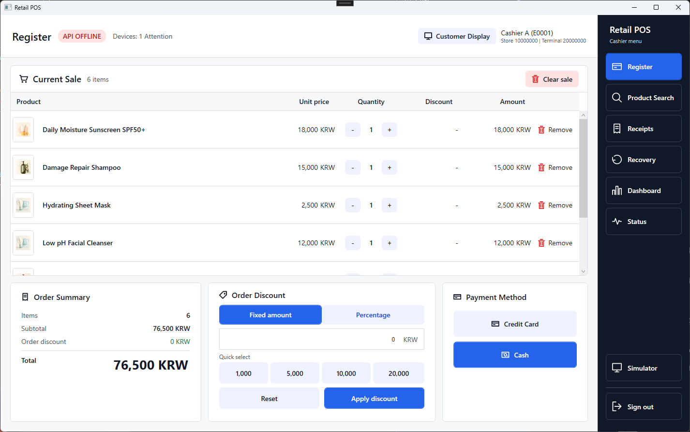

## Why This Project

Retail checkout cannot simply stop when a network or peripheral becomes unreliable. This
project treats those failure modes as core product behavior rather than demo-only exceptions.

| Product concern | Implemented approach |
| --- | --- |
| Network loss during sales | Complete the order locally and persist upload work for retry |
| Ambiguous card-terminal result | Fail closed to an `Unknown` recovery state instead of guessing |
| Duplicate server submission | Reuse a stable `storeId + terminalId + localOrderId` identity |
| Process restart | Persist pending checkout, completed orders, receipts, and sync queue in SQLite |
| Hardware-free development | Simulate scanner, printer, card terminal, and customer display through typed device boundaries |
| Operator visibility | Surface sales, recovery, device health, and synchronization state in dedicated screens |

## Product Tour

### Sign-in and sales workspace

<table>
  <tr>
    <td width="50%">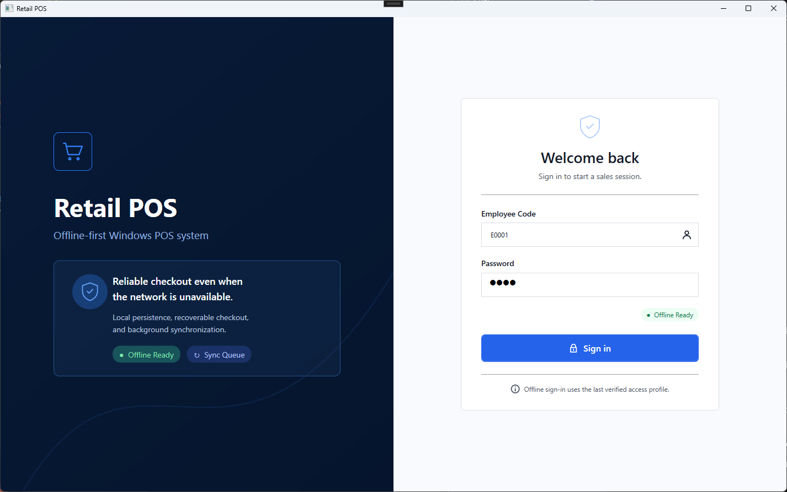</td>
    <td width="50%">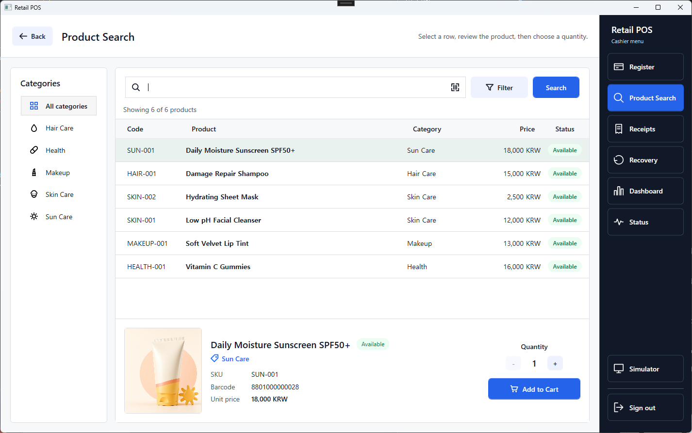</td>
  </tr>
  <tr>
    <td align="center">Offline-ready cashier sign-in</td>
    <td align="center">Search, category filtering, product detail, and cart entry</td>
  </tr>
</table>

### Inline checkout and customer display

<table>
  <tr>
    <td width="50%">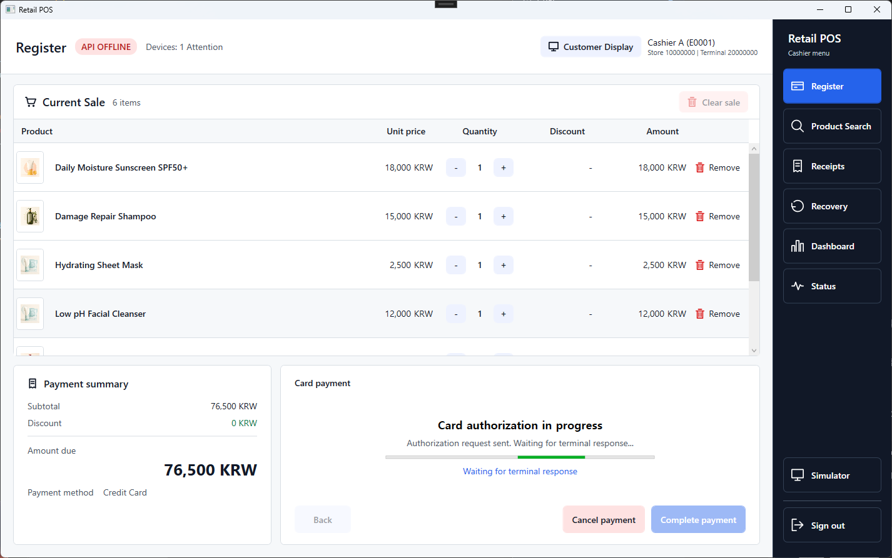</td>
    <td width="50%">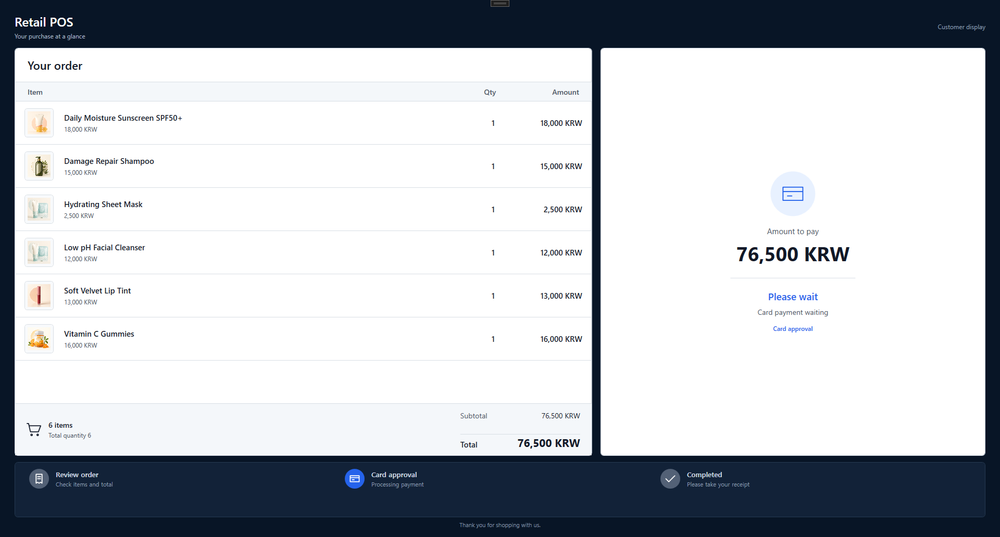</td>
  </tr>
  <tr>
    <td align="center">Card authorization remains inside the register workflow</td>
    <td align="center">A separate customer-facing window follows cart and payment state</td>
  </tr>
</table>

### Device simulation and persisted receipts

<table>
  <tr>
    <td width="50%">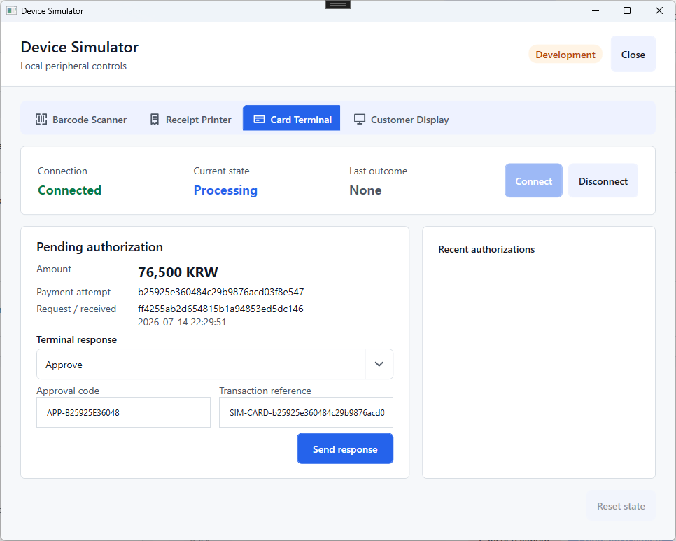</td>
    <td width="50%">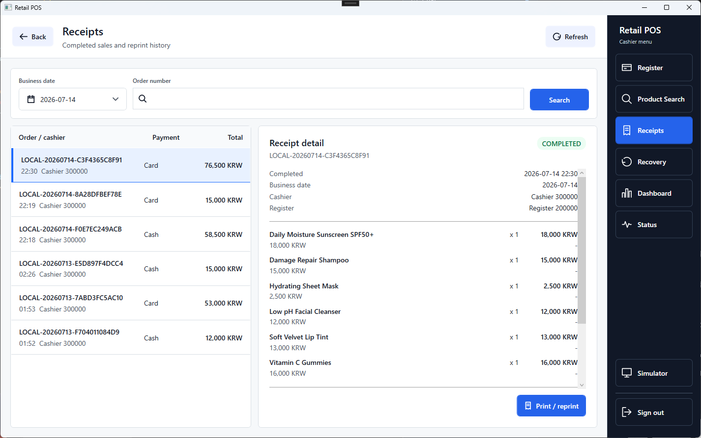</td>
  </tr>
  <tr>
    <td align="center">Typed terminal outcomes without real payment data</td>
    <td align="center">Persisted receipt history, detail, and reprint</td>
  </tr>
  <tr>
    <td width="50%">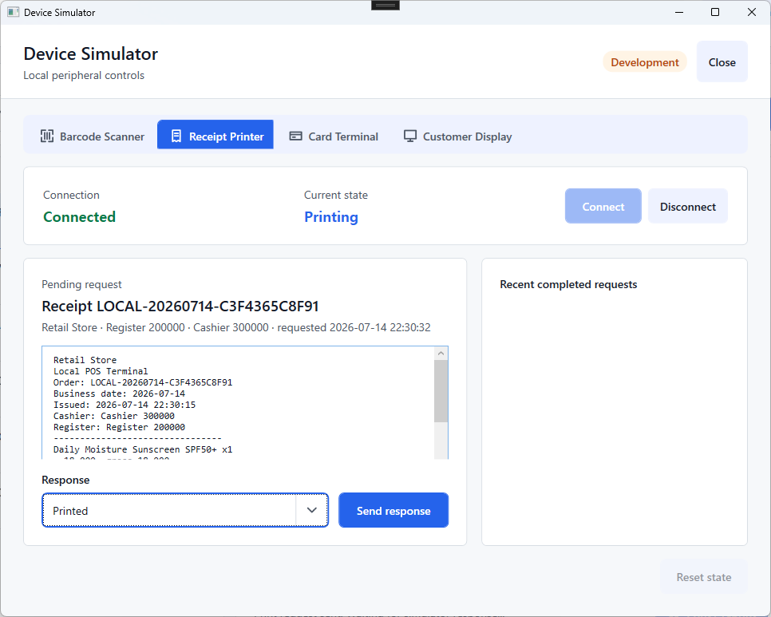</td>
    <td width="50%">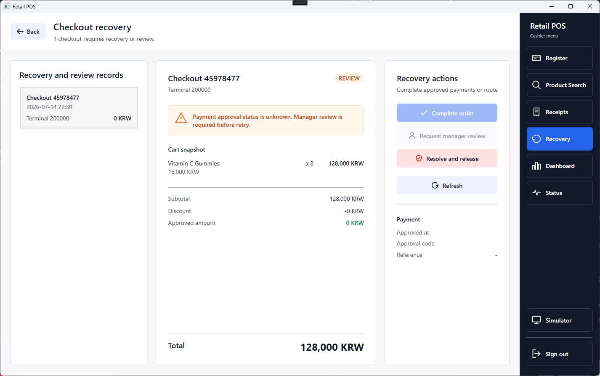</td>
  </tr>
  <tr>
    <td align="center">Operator-controlled printer responses and retry scenarios</td>
    <td align="center">Explicit review for ambiguous or interrupted payments</td>
  </tr>
</table>

### Operations and system health

<table>
  <tr>
    <td width="50%">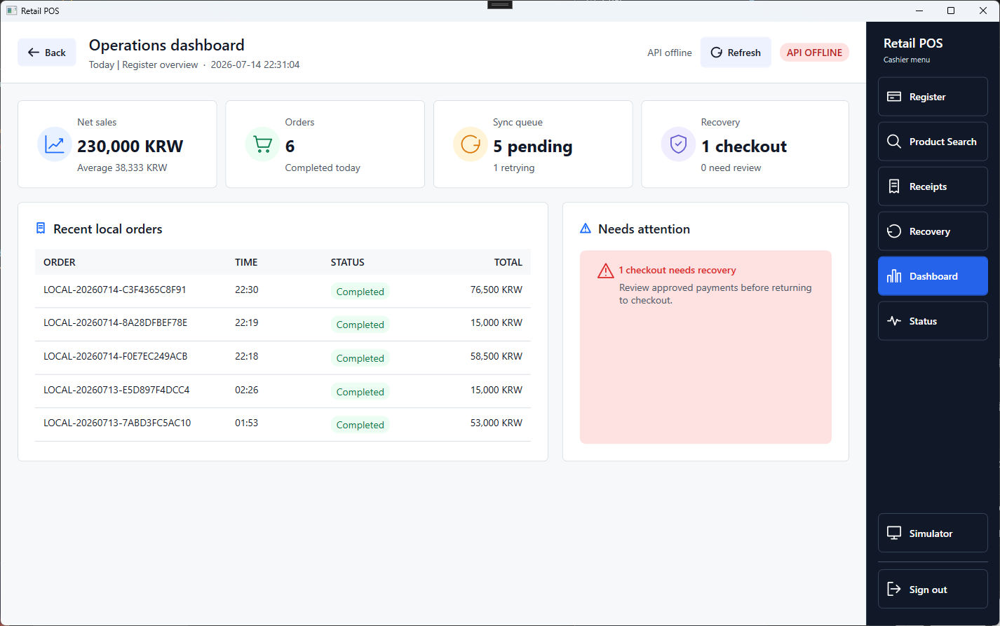</td>
    <td width="50%">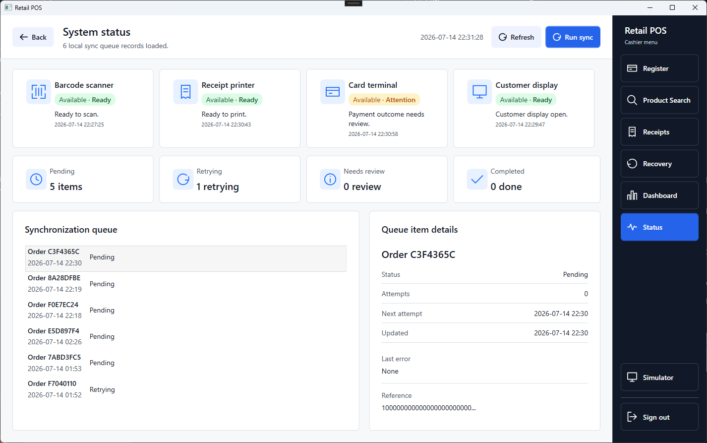</td>
  </tr>
  <tr>
    <td align="center">Local sales, queue, and recovery overview</td>
    <td align="center">Device readiness and durable synchronization queue</td>
  </tr>
</table>

See the complete, individually linked gallery in [docs/screenshots](docs/screenshots/README.md).

## Engineering Highlights

- **Offline-first checkout:** completed sales are stored locally and are not coupled to API
  availability.
- **Recoverable payment workflow:** `PendingCheckout` is durable before authorization;
  timeout, communication loss, and interrupted requests become reviewable states.
- **Idempotent synchronization:** retry metadata survives restart and duplicate uploads are
  prevented at the central order boundary.
- **Clean device boundaries:** cashier workflows depend on application ports while simulator
  controls remain in Infrastructure/Desktop-only surfaces.
- **Deterministic concurrency:** device requests have a single terminal transition, late
  responses cannot rewrite completed outcomes, and scanner callbacks are dispatcher-safe.
- **Explicit session teardown:** sign-out cancels pending work and clears cart, checkout,
  receipt, simulator, display, and cashier session state.
- **Safe demo payment model:** the terminal simulator uses amount and business identifiers
  only; it does not model PAN, CVV, track data, or card tokens.

## Architecture

The solution follows a practical Clean Architecture dependency direction. Domain and
application rules stay independent from WPF, SQLite, HTTP, and device implementations.

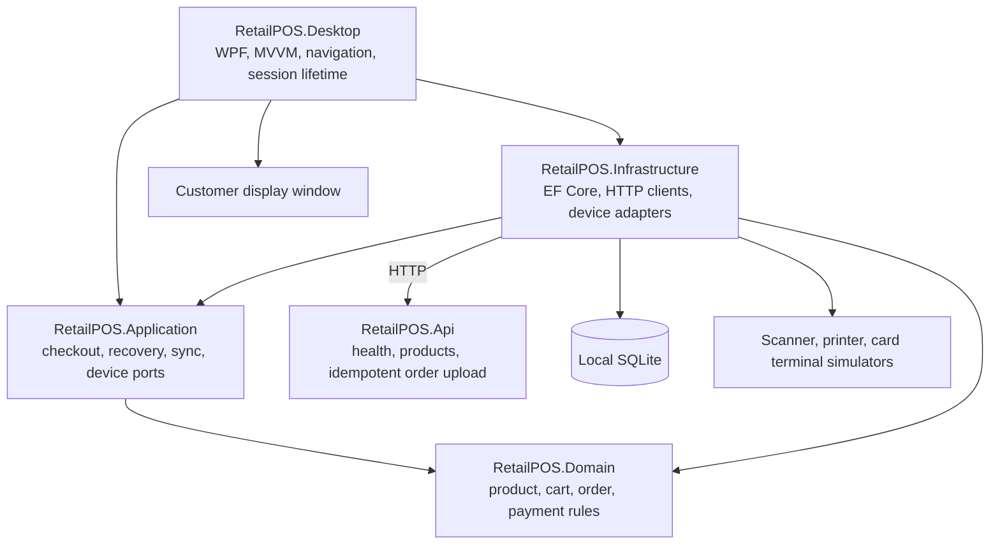

The critical checkout path becomes durable before it depends on a device or network:

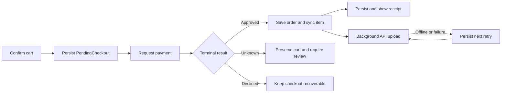

For design decisions and concrete code/test evidence, see the
[Demo Guide and Portfolio Summary](docs/demo-and-portfolio.md).

## Technology Stack

| Layer | Technology |
| --- | --- |
| Desktop client | C#, .NET 8, WPF, CommunityToolkit.Mvvm |
| Local persistence | EF Core, SQLite, migrations and repositories |
| Central API | ASP.NET Core minimal API, ProblemDetails, request logging |
| Runtime composition | Generic Host, dependency injection, options validation |
| Diagnostics | Serilog structured logging and operational status screens |
| Verification | xUnit across Domain, Application, Infrastructure, Desktop, and API test projects |
| Delivery | GitHub Actions build, test, TRX, and coverage artifacts |

## Run the Demo

Prerequisites: Windows 10 or later and the .NET 8 SDK.

```powershell
dotnet restore RetailPOS.sln
dotnet build RetailPOS.sln -c Debug --no-restore
```

Start the API:

```powershell
dotnet run --project src\RetailPOS.Api\RetailPOS.Api.csproj --launch-profile http --no-build
```

Start the desktop client in another terminal:

```powershell
dotnet run --project src\RetailPOS.Desktop\RetailPOS.Desktop.csproj --no-build
```

Development-only demo accounts:

| Role | Employee code | Password |
| --- | --- | --- |
| Cashier | `E0001` | `1234` |
| Manager | `M0001` | `1234` |

The deterministic login and device simulator are disabled by production defaults. Follow
the [step-by-step demo guide](docs/demo-and-portfolio.md) for card, printer, offline sync,
and recovery scenarios.

## Solution Structure

```text
RetailPOS
|- src
|  |- RetailPOS.Domain
|  |- RetailPOS.Application
|  |- RetailPOS.Infrastructure
|  |- RetailPOS.Desktop
|  `- RetailPOS.Api
|- tests
|  |- RetailPOS.Domain.Tests
|  |- RetailPOS.Application.Tests
|  |- RetailPOS.Infrastructure.Tests
|  |- RetailPOS.Desktop.Tests
|  `- RetailPOS.Api.Tests
`- docs
   |- screenshots
   |- architecture.md
   |- decisions.md
   `- demo-and-portfolio.md
```

## Documentation

- [Demo Guide and Portfolio Summary](docs/demo-and-portfolio.md)
- [Screenshot Gallery](docs/screenshots/README.md)
- [Project Overview](docs/project-overview.md)
- [Architecture](docs/architecture.md)
- [Architecture Decisions](docs/decisions.md)
- [Sync and Offline Behavior](docs/sync-and-offline.md)
- [API Contracts](docs/api-contracts.md)
- [UI Guide](docs/ui-guide.md)
- [Roadmap](docs/roadmap.md)

## UI Reference

The [Figma design](https://www.figma.com/design/G71mpke3GSKytIXRqsjD8D/Retail-POS-UI)
remains the primary visual reference for WPF implementation. See the
[UI Guide](docs/ui-guide.md) for repository-specific mapping rules.

## Scope and Limitations

This is a production-shaped portfolio demonstration, not production retail software.

- Authentication is deterministic and development-only; there is no production identity
  provider or secure offline credential store.
- Scanner, receipt printer, card terminal, and customer display integrations are simulators,
  not vendor SDK integrations.
- The API demo order store is in memory and server-side inventory persistence is intentionally
  limited.
- Installer, fleet provisioning, remote configuration, refunds, promotions, coupons, and
  memberships are outside the current scope.

These boundaries are explicit so the repository demonstrates engineering decisions without
claiming unsupported production capabilities.

## Development Process

The project was built issue by issue with scoped acceptance criteria, review-driven follow-up,
and CI validation. ChatGPT and Codex were used for design discussion, implementation support,
documentation, and review; product decisions, architecture trade-offs, acceptance, and final
code ownership remained with the project owner.
