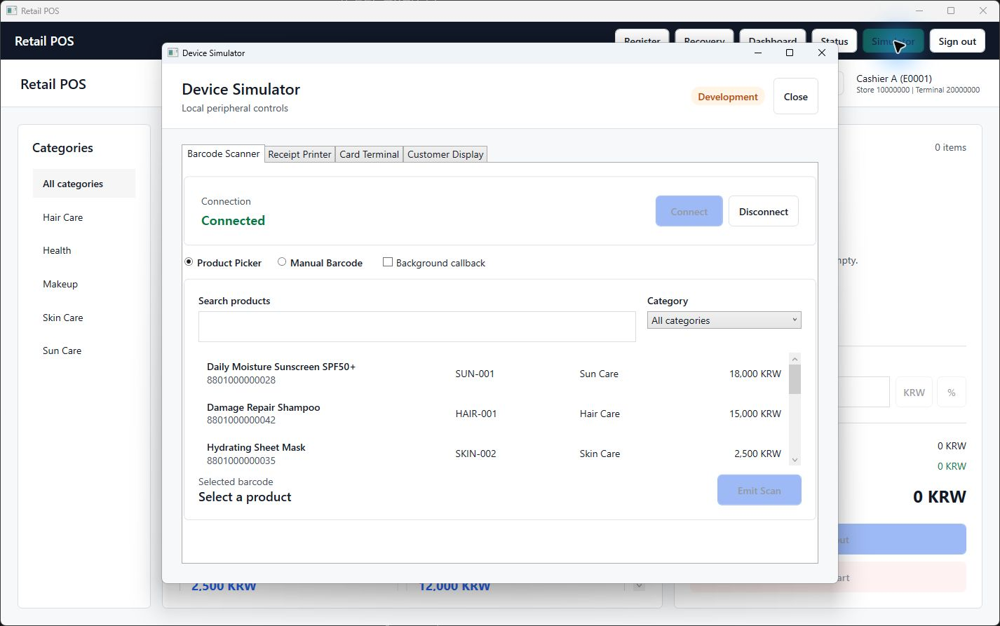
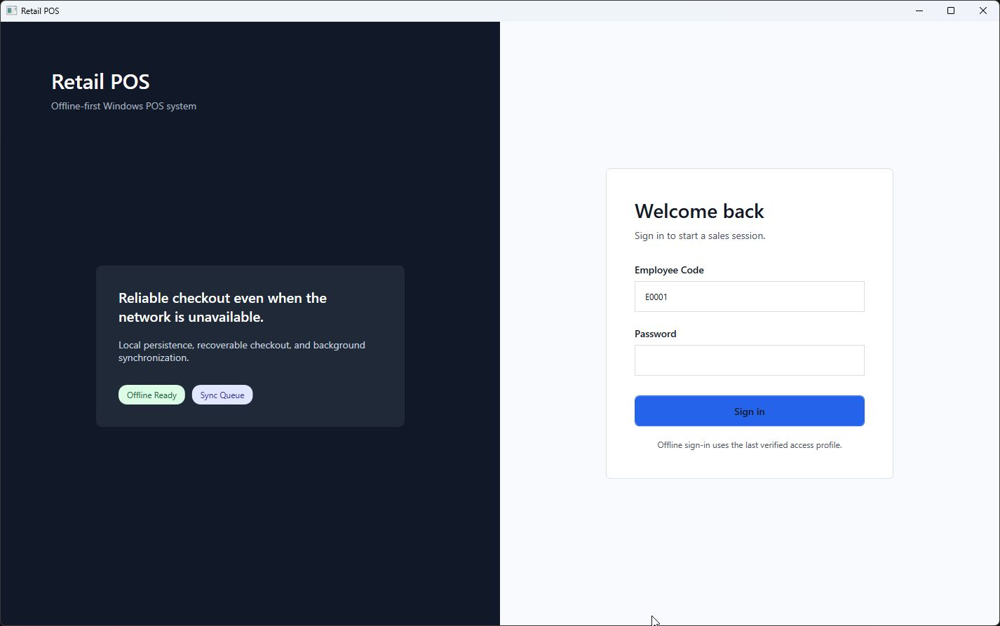
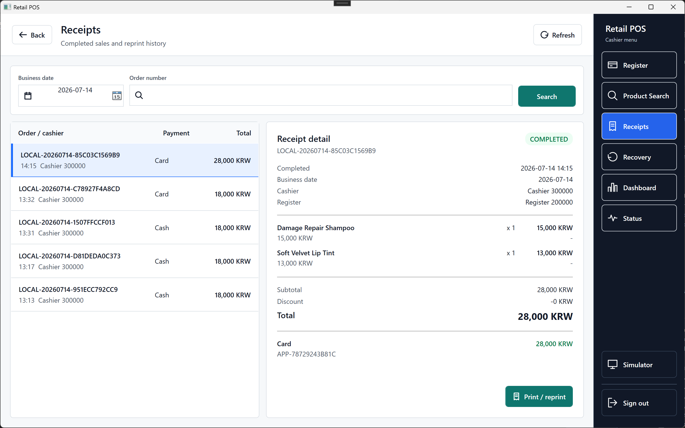
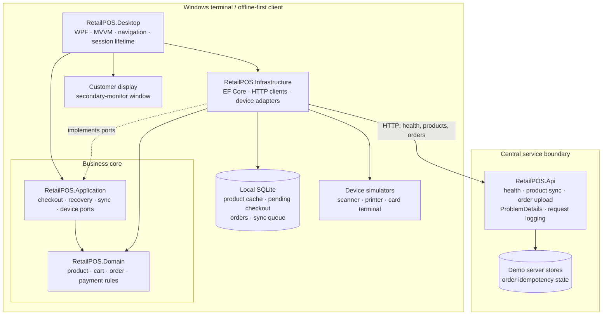
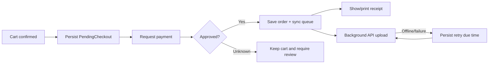
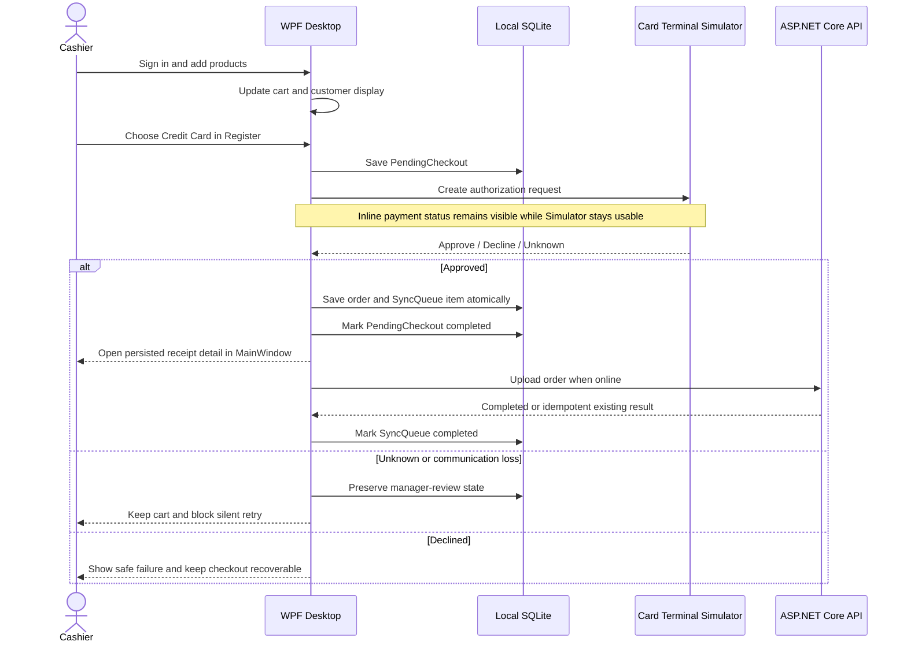
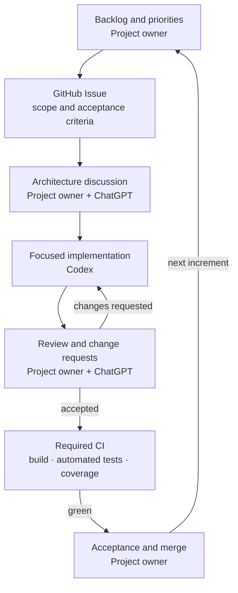

# Retail POS Desktop

[](https://github.com/higwon/retail-pos-desktop/actions/workflows/ci.yml)

A portfolio-oriented Windows desktop POS system built with C# and .NET 8.

The project focuses on offline-first retail sales, recoverable checkout, local SQLite persistence, central API synchronization, simulated POS devices, and maintainable WPF architecture.



The screenshot shows the cashier register and the modeless Device Simulator running
together. Scanner, printer, card-terminal, and customer-display behavior can be exercised
without coupling simulator controls to cashier business commands.

<table>
  <tr>
    <td width="50%"></td>
    <td width="50%"></td>
  </tr>
  <tr>
    <td align="center">Demo cashier/manager sign-in</td>
    <td align="center">Persisted receipt history, detail, and reprint</td>
  </tr>
</table>

## At a Glance

| Area | Implementation |
| --- | --- |
| Client | Windows WPF, MVVM, CommunityToolkit.Mvvm |
| Offline operation | Local SQLite through EF Core migrations and repositories |
| Safe checkout | `PendingCheckout` is persisted before payment authorization |
| Device integration | Operator-driven scanner, printer, card-terminal, and customer-display simulators |
| Synchronization | Background upload, reconnect trigger, retry/exhausted states, stable idempotency identity |
| API | ASP.NET Core minimal API with health, product/order contracts, ProblemDetails, and request logging |
| Verification | Automated tests across five test projects with required Windows CI and coverage artifacts |

## Key Engineering Highlights

- **Fail-closed payment recovery:** timeout and communication loss become `Unknown` manager
  review states instead of guessed approvals or declines.
- **Durable offline checkout:** local order completion does not depend on API availability;
  retry due times and idempotency identity survive restart in SQLite.
- **Production-shaped device boundaries:** cashier commands depend on business ports while
  simulator scenario controls stay in Infrastructure/Desktop-only surfaces.
- **Explicit lifecycle and concurrency rules:** terminal transitions are single-winner,
  scanner callbacks are dispatcher-safe, and sign-out tears down pending session work.

## System Design

The solution follows a practical Clean Architecture dependency direction. Business rules
remain independent of WPF, SQLite, HTTP, and simulator implementations.



Solid arrows inside the client are compile-time dependencies or owned adapters. The dashed
arrow means Infrastructure implements interfaces defined by Application. The HTTP arrow is
the runtime boundary between the offline-capable terminal and the central API.

Project responsibilities:

- **Domain** owns business entities and invariants and has no project dependencies.
- **Application** owns checkout, recovery, sync, authentication, receipt, and device ports.
- **Infrastructure** implements SQLite persistence, HTTP clients, and device simulators.
- **Desktop** owns WPF presentation, terminal session lifetime, navigation, and composition.
- **API** exposes the central health/product/order boundaries and idempotent upload behavior.

The most important runtime path is durable before it is connected:



## How It Works

The cashier and device operator can use the POS and Simulator at the same time. A normal
card sale runs through the following production-shaped boundaries:



Offline operation uses the same checkout path; only the upload is deferred:

1. Products, the pending checkout, completed order, and sync queue live in local SQLite.
2. If the API is unavailable, checkout still completes locally and the queue stores its next
   retry time.
3. The connectivity monitor detects recovery and triggers a bounded synchronization run.
4. A stable `storeId + terminalId + localOrderId` identity prevents duplicate server orders.
5. After restart, interrupted or Unknown payments are routed to Recovery instead of being
   guessed as approved or declined.

The other simulated devices follow the same separation:

- **Barcode Scanner:** the operator selects a product or enters a raw barcode; the scanner
  raises an event that is marshalled to the WPF dispatcher before the cart changes.
- **Receipt Printer:** Print creates a pending request containing safe receipt data; the
  operator responds Printed, Paper out, Cover open, Timeout, or another typed result.
- **Customer Display:** cart/payment state is shared with a Desktop-owned window that moves
  between secondary monitors without creating duplicate display windows.
- **Sign out:** pending payment and print work is cancelled, scanner coordination stops,
  Simulator and Customer Display close, and cart, receipt, checkout, and cashier session
  state are cleared.

For a clean-checkout walkthrough, screenshots, explicit limitations, and links to concrete
code/tests, see the [Demo Guide and Portfolio Summary](docs/demo-and-portfolio.md).

## Documentation

Start here:

1. [Project Overview](docs/project-overview.md)
2. [Architecture](docs/architecture.md)
3. [Roadmap](docs/roadmap.md)
4. [Demo Guide and Portfolio Summary](docs/demo-and-portfolio.md)

For implementation planning:

- [Epics and Tasks](docs/epics-and-tasks.md)
- [Development Workflow](docs/development-workflow.md)
- [Repository Agent Guide](docs/agent-guide.md)

For specific areas:

- [API Contracts](docs/api-contracts.md)
- [Sync and Offline](docs/sync-and-offline.md)
- [UI Guide](docs/ui-guide.md)
- [Decisions](docs/decisions.md)
- [Demo Guide and Portfolio Summary](docs/demo-and-portfolio.md)

AI coding agents should also read [AGENTS.md](AGENTS.md) before working in this repository.

## Figma UI Reference

Figma file:

https://www.figma.com/design/G71mpke3GSKytIXRqsjD8D/Retail-POS-UI

The Figma file is the primary UI reference for WPF screen implementation. Use [UI Guide](docs/ui-guide.md) for repository-specific mapping notes.

## Technology Stack

- C# and .NET 8
- WPF
- MVVM
- CommunityToolkit.Mvvm
- Microsoft.Extensions.Hosting and DependencyInjection
- EF Core with SQLite for local offline storage
- ASP.NET Core Web API
- Serilog for desktop structured logging
- xUnit tests

## Solution Structure

```text
RetailPOS
|- AGENTS.md
|- docs
|- src
|  |- RetailPOS.Desktop
|  |- RetailPOS.Application
|  |- RetailPOS.Domain
|  |- RetailPOS.Infrastructure
|  `- RetailPOS.Api
`- tests
   |- RetailPOS.Api.Tests
   |- RetailPOS.Application.Tests
   |- RetailPOS.Desktop.Tests
   |- RetailPOS.Domain.Tests
   `- RetailPOS.Infrastructure.Tests
```

## Development Process

The project was developed through an issue-driven workflow inspired by Scrum. Each feature
started as a scoped GitHub issue with explicit acceptance criteria.

AI tools (ChatGPT and Codex) were used to accelerate design discussions, implementation,
documentation, and code review. They operated within the project workflow; they did not own
the product or its engineering decisions.

The project owner remained responsible for:

- product decisions;
- architecture and technical trade-offs;
- review feedback and requested changes;
- acceptance against the issue criteria;
- final code ownership and merge decisions.



This made AI usage repeatable and auditable rather than ad hoc. GitHub history preserves the
issue scope, acceptance criteria, review-driven corrections, CI evidence, and author-approved
merge for each significant increment.

## Development Rule

Build the project step by step, issue by issue. Keep each PR focused, update docs when project rules change, and keep code behavior aligned with the current source-of-truth documents.
