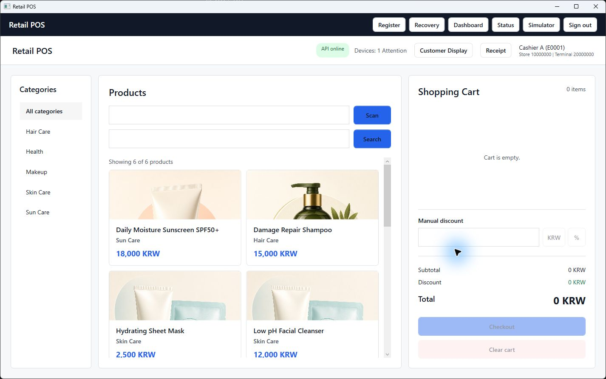

# Demo Guide and Portfolio Summary

## What This Demonstrates

Retail POS Desktop is a Windows/.NET 8 portfolio system for offline-first checkout.
The demo uses local SQLite persistence, an ASP.NET Core API, WPF/MVVM screens, and
operator-controlled scanner, printer, payment-terminal, and customer-display simulators.

This is a production-shaped demonstration, not production retail software. Demo login,
in-memory API stores, simulated devices, and local developer configuration are explicit
boundaries rather than claims of real identity, acquiring, hardware, or deployment support.

## Clean-Checkout Setup

Prerequisites:

- Windows 10 or later.
- .NET 8 SDK.
- A second monitor only for the customer-display portion.

From the repository root:

```powershell
dotnet restore RetailPOS.sln
dotnet build RetailPOS.sln -c Debug --no-restore
```

Start the API in one PowerShell window:

```powershell
dotnet run --project src\RetailPOS.Api\RetailPOS.Api.csproj --launch-profile http --no-build
```

Verify the API before starting the client:

```powershell
Invoke-RestMethod http://localhost:5282/api/health
```

The response should report `Healthy`. Start the Desktop client in a second window:

```powershell
dotnet run --project src\RetailPOS.Desktop\RetailPOS.Desktop.csproj --no-build
```

The checked-in Desktop launch profile selects `DOTNET_ENVIRONMENT=Development`.
Development configuration enables demo login and the Device Simulator and points the
client at the API `http` launch profile on `http://localhost:5282/`. Production defaults
deliberately disable both demo-only features and require HTTPS.

Demo accounts:

| Role | Employee code | Password |
| --- | --- | --- |
| Cashier | `E0001` | `1234` |
| Manager | `M0001` | `1234` |

These credentials exist only in `DemoLoginService`; they are not a production identity
store and are enabled only by the Development/Demo runtime configuration.


## Reset the Demo

Close the Desktop application before deleting its database. The API order store is
in-memory, so restarting the API resets server-side demo uploads.

```powershell
Remove-Item "$env:LOCALAPPDATA\RetailPOS\retail-pos.db" -ErrorAction SilentlyContinue
Remove-Item "$env:LOCALAPPDATA\RetailPOS\logs" -Recurse -Force -ErrorAction SilentlyContinue
```

Restart the API and Desktop. Database migrations and the six-product health-and-beauty
seed run automatically. To preserve an offline/recovery scenario, do not delete the database.

## Core Operator Demo

### 1. Sign in and build a cart

1. Sign in as `E0001 / 1234`.
2. Select a category or search for a product and activate the product card.
3. Open **Simulator** > **Barcode Scanner**, choose **Product Picker**, select a product,
   and choose **Emit Scan**. Repeat it to show quantity accumulation.
4. Enter a whole-KRW amount or percentage under **Manual discount** and apply it.



What this shows: the cashier path reads products from SQLite, supports direct and
event-driven cart entry, and keeps simulator-only controls outside cashier ViewModels.


### 2. Complete an operator-driven card payment

1. Choose **Checkout**, then **Card payment**.
2. Keep the Payment window open and switch to **Simulator** > **Card Terminal**.
3. Inspect the pending authorization amount and payment-attempt identity.
4. Select **Approve**, optionally edit the safe approval code/reference fields, and send
   the response.
5. Confirm that the order completes exactly once and Receipt opens.

What this shows: a persisted `PendingCheckout` precedes terminal authorization. Only an
approved typed response creates the order; no card number, track data, or token enters the
request/history model.

### 3. Print the receipt through the simulator

1. Choose **Print** in Receipt.
2. Open **Simulator** > **Receipt Printer** and inspect the receipt identity, cashier,
   register, items, totals, payments, and printable text.
3. Send **Paper out**, confirm the Receipt status reports failure, then retry.
4. Send **Printed** for the new request and confirm success appears in the same header area.

What this shows: receipt generation is independent of printer availability, retries use a
new request identity, and late/duplicate responses cannot rewrite a terminal result.

### 4. Demonstrate offline checkout and reconnect sync

1. Stop the API while leaving Desktop open.
2. Wait for the header/status connectivity state to report offline.
3. Complete another sale through the simulator. The order and queue item remain durable in
   local SQLite even though upload cannot complete.
4. Open **Status** and observe Pending/Retrying state.
5. Restart the API, wait for reconnect-triggered sync or choose **Run sync**, and confirm the
   queue item becomes Completed.
6. Run sync again to demonstrate that a completed queue record is not uploaded twice.

What this shows: selling is not coupled to API availability. Retry identity remains stable,
and the API order boundary applies `storeId + terminalId + localOrderId` idempotency rules.

### 5. Demonstrate Unknown payment and restart recovery

1. Start a card payment and respond **Unknown** or **Communication loss** from Card Terminal.
2. Confirm the cart is not cleared, no order is created, and immediate silent retry is blocked.
3. Close and restart Desktop without deleting the database, then sign in.
4. Open **Recovery** (startup also routes there when recoverable work exists).
5. Review the Unknown payment and use the manager-review resolution path only after the
   external payment outcome has been verified.

For the interrupted variant, close Desktop while a terminal request is pending. On restart,
the persisted awaiting-payment record becomes Unknown/manager review rather than being
treated as a decline or approval.

### 6. Show operational and session lifecycle behavior

1. Open **Dashboard** to show database-computed sales aggregates, bounded recent orders,
   connectivity, sync, and recovery attention.
2. Open **Status** to show device availability/readiness separately from simulator controls.
3. With a second monitor, open **Customer Display**, move the existing window to another
   target, and disconnect/reconnect that target.
4. Start a pending device request and choose **Sign out**. Confirm scanner input stops,
   pending work is cancelled, workflow/customer-display windows close, and login returns.
5. Sign in again and confirm the previous cart, receipt, checkout, and cashier state is absent.

## Architecture Narrative

The solution follows a practical Clean Architecture dependency direction:

```text
Desktop -> Application, Domain, Infrastructure
Api     -> Application, Domain, Infrastructure
Infrastructure -> Application, Domain
Application -> Domain
Domain -> none
```

Key engineering points:

| Claim | Concrete evidence |
| --- | --- |
| Checkout survives process/network boundaries | `PendingCheckout` decision in [DEC-004](decisions.md#dec-004-store-pendingcheckout-before-payment-approval), [CheckoutRecoveryService](../src/RetailPOS.Application/Checkout/ICheckoutRecoveryService.cs), and [restart recovery tests](../tests/RetailPOS.Infrastructure.Tests/RestartRecoveryIntegrationTests.cs) |
| Upload retries are duplicate-safe | [DEC-007](decisions.md#dec-007-order-upload-identity-and-idempotency), [OrderSyncService](../src/RetailPOS.Application/Sync/OrderSyncService.cs), [API idempotency handler](../src/RetailPOS.Api/Orders/IdempotentOrderUploadHandler.cs), and [sync integration tests](../tests/RetailPOS.Api.Tests/OrderSyncIntegrationTests.cs) |
| Device controls do not leak into business ports | [DEC-011](decisions.md#dec-011-separate-device-business-ports-from-simulator-controls), [Application device interfaces](../src/RetailPOS.Application/Devices), and [Infrastructure simulators](../src/RetailPOS.Infrastructure/Devices) |
| Concurrent/late device results are deterministic | [DeviceRequestQueue](../src/RetailPOS.Infrastructure/Devices/DeviceRequestQueue.cs), [payment terminal tests](../tests/RetailPOS.Infrastructure.Tests/SimulatedPaymentTerminalTests.cs), and [receipt printer tests](../tests/RetailPOS.Infrastructure.Tests/SimulatedReceiptPrinterTests.cs) |
| Session teardown is explicit | [SessionSignOutCoordinator](../src/RetailPOS.Desktop/Workflow/SessionSignOutCoordinator.cs) and [cashier lifecycle tests](../tests/RetailPOS.Desktop.Tests/CashierHappyPathTests.cs) |
| Large local histories have measured bounds | [PersistenceRepositoryTests](../tests/RetailPOS.Infrastructure.Tests/PersistenceRepositoryTests.cs), [SqliteDashboardRepository](../src/RetailPOS.Infrastructure/Persistence/Repositories/SqliteDashboardRepository.cs), and the [performance baseline](development-workflow.md#common-commands) |
| Automated quality evidence is repeatable | [CI workflow](../.github/workflows/ci.yml), five test projects, TRX output, and Cobertura artifacts |
| Configuration fails safely | [DesktopConfigurationValidator](../src/RetailPOS.Desktop/Configuration/DesktopConfigurationValidator.cs), [startup logging split](../src/RetailPOS.Desktop/Configuration/DesktopStartupConfiguration.cs), and [configuration tests](../tests/RetailPOS.Desktop.Tests/DesktopConfigurationValidatorTests.cs) |

### Concurrency and failure policy

- Device requests have one terminal transition. Completion continuations run
  asynchronously, and callbacks are not invoked while internal locks are held.
- Scanner callbacks are marshalled to the WPF dispatcher and a Start/Stop session token
  invalidates scans that were already waiting when the cashier leaves the screen.
- Payment is fail-closed: timeout, communication loss, or unconfirmed post-dispatch
  cancellation is `Unknown`, never a guessed decline or approval.
- Background sync is bounded, non-overlapping, cancellation-aware, and stops automatic retry
  after the documented 1/2/4/8/16-minute policy.

### Security and privacy boundaries

- Production profile requires HTTPS and disables deterministic login and simulator controls.
- UI messages are user-safe; technical exceptions stay in structured diagnostics.
- Logs exclude passwords, tokens, raw idempotency keys, approval codes, transaction
  references, and payment-sensitive values.
- The payment simulator carries amount and business identity only. It does not model PAN,
  track data, CVV, or card tokens.

## Explicit Limitations

- Demo credentials are deterministic and there is no production identity provider or secure
  cached employee credential store.
- API product sync currently returns an empty contract-shaped feed; demo products come from
  the local SQLite seed.
- The API idempotency store is in memory and is cleared when the API process restarts.
- Printer, scanner, payment terminal, and customer display are simulators, not vendor SDKs.
- There is no installer, device provisioning, remote configuration, or production deployment
  pipeline.
- Server-side stock persistence is skeletal; estimated local stock and pending deductions are
  target behavior, not a completed claim.
- Refunds, order cancellation, coupons, promotions, memberships, and discount rule engines are
  outside the shipped MVP.
- Accessibility and DPI behavior has an explicit Windows manual checklist; automated tests
  cover ViewModel/host logic but do not replace screen-reader, 100/150% DPI, or monitor-topology
  smoke testing.

## Phase 2 Direction

Phase 2 can replace the demonstrated boundaries without rewriting checkout rules: production
identity and cached offline credentials, durable server storage and stock, real hardware
adapters, deployment/provisioning, and advanced retail workflows such as refunds,
cancellations, promotions, coupons, and membership pricing.

## Additional Screenshot Checklist

The Login, Register, and modeless Device Simulator screenshots above were captured from
the current Development build. Capture these additional workflow states before publishing
a longer portfolio case study:

1. Card Terminal pending authorization beside the modeless Payment window.
2. Receipt Printer pending request beside Receipt.
3. Dashboard and Status after an offline order is queued.
4. Recovery showing an Unknown payment without sensitive terminal data.

Do not use screenshots containing machine paths, logs, secrets, or real employee/payment data.
